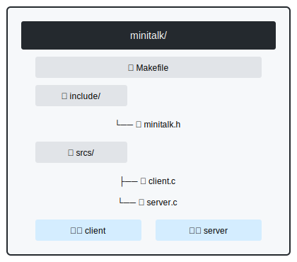

# minitalk - UNIX Signal-Based IPC

  

## Overview

**minitalk** is a lightweight client-server application demonstrating UNIX signal-based inter-process communication (IPC). Implemented in C, this project shows how processes can exchange data using `SIGUSR1` and `SIGUSR2` signals to transmit binary-encoded messages.

## Project Structure




## How It Works

## 🔄 Communication Theory

### **Signal-Based IPC Overview**
minitalk demonstrates **UNIX signal inter-process communication (IPC)** using:
- `SIGUSR1` → Binary `1`
- `SIGUSR2` → Binary `0`

### **Client-Server Workflow**
```mermaid
sequenceDiagram
    participant Client
    participant Server

    Note over Server: Starts first<br>Displays PID
    Client->>Server: 1. Sends message length (32 bits)
    Server-->>Client: SIGUSR2 (ACK each bit)
    Client->>Server: 2. Transmits each character (8 bits/char)
    Client->>Server: 3. Sends null terminator
    Server-->>Client: SIGUSR1 (ACK)
    Note over Client: Exits on acknowledgment
